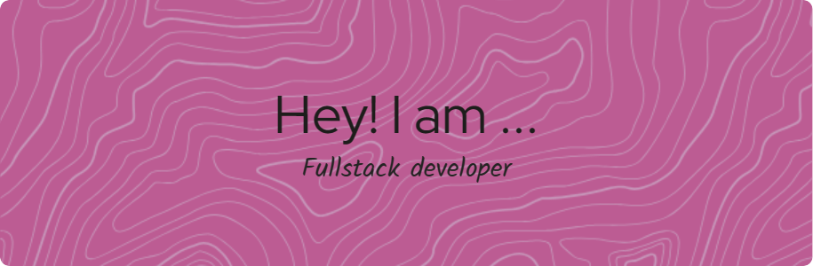

# 💫 Sobre mi:
Estudiante de grado medio de informática enfocado en ciberseguridad y desarrollo web. Apasionado por explorar los entresijos de la seguridad cibernética mientras profundiza en el desarrollo web con habilidades en HTML, CSS y un interés creciente en otros lenguajes y tecnologías relacionadas.

## 🌐 Redes:
 

# 💻 Mis skills:
            
# 📊 Estadisticas:
 
 

## 🏆 Logros GitHub

---

<!-- Proudly created with GPRM ( https://gprm.itsvg.in ) -->
